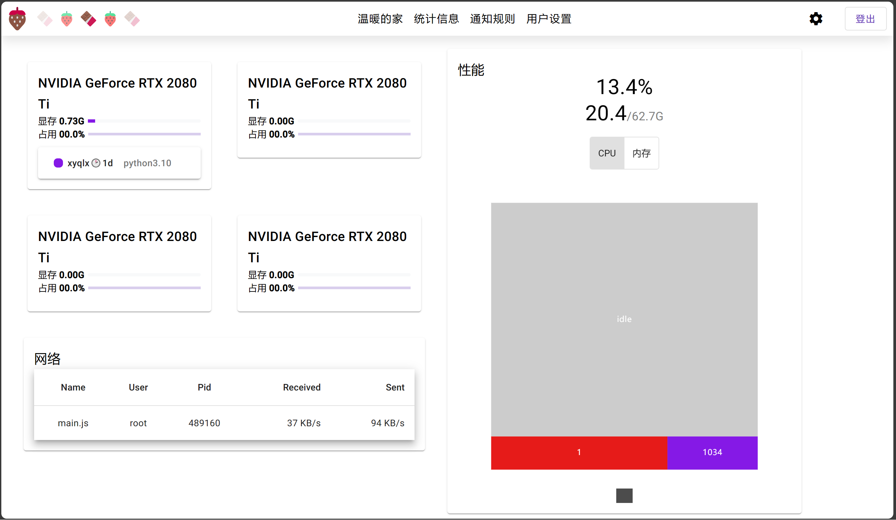

# chocoberry-ng

服务器监控系统`chocoberry`的前端部分，使用Angular开发

这里是一个演示<https://xyqlx.github.io/chocoberry-ng>



## Note: This README is currently available only in Chinese.

We apologize that at the moment, the documentation and instructions for this project are provided only in Chinese.

## 关于后端

使用Nest.js开发，不过由于安全问题，暂时处于private状态

## 功能和技术细节

### 用户管理

- 用户登录：使用JWT，登录后会在localStorage中保存access token
- 用户注册：在`开放注册`开启的情况下，用户可以注册新账号（没有提供邮箱验证）
- 角色管理：管理员可以修改`开放注册`状态

### `温暖的家`页面

#### GPU监控

根据显卡的数量，显示每个显卡的以下信息：

- 显卡型号
- 显存占用大小与占比（每个进程的显存占用在比例条上采用不同色彩区分）
- 显卡使用率
- 显卡上运行的所有进程的信息

每个进程包括以下信息：

- 所属用户名、用户ID
- 从运行开始的时间长度、运行开始时间
- 进程号、父进程号
- 程序名、命令行参数、工作目录

还可以从这里添加监听进程结束的通知，见下文

#### 网络流量信息

显示网络流量占用最大的部分进程，包括进程号，用户名，程序名，发送和接收的流量大小

#### CPU和内存信息

以数字形式显示CPU和内存的使用率，并且提供一个不同进程CPU/内存占用的tree map，将使用率作为面积显示

#### 设置

包括为每个进程映射颜色的方法，以及tree map的设置

- 进程色彩饱和度/亮度：从进程号映射到颜色的算法参数
- leafDepth：tree map的深度

### `统计信息`页面

这里以折线图形式显示服务器的一些历史信息，可以选择24小时或7天的时间范围

包括以下信息：

- CPU和内存的变化情况
- 每个显卡的显存占用和使用率变化情况

### `通知规则`页面

这里将会显示本用户的所有通知规则，并且可以添加新的通知规则或者删除已有的通知规则

可以选择的触发方式包括：

- 显卡占用变动：当显卡空置或者被占用时触发。可以选择触发的次数
- 进程结束：当某个进程结束时触发
- 定时：选择时间触发

可以选择的通知方式包括：

- 邮件：发送邮件到注册邮箱
- 浏览器通知：使用Web Notification API发送通知，注意此功能需要HTTPS并且用户同意

### `用户设置`页面

这里可以销毁用户

如果用户是管理员，还可以修改`开放注册`状态

### 一些技术细节

- WebSocket：在浏览器通知中使用WebSocket从后端发送通知消息到前端
- Mock Service Worker：很好用，这里主要用来制作无后端的演示版本
- Angular Material：基本上用的是Angular Material的组件
- 其他的想起来再补充吧

### 隐含的安全问题

目前而言主要的安全隐患还是集中在后端，一方面没有控制敏感信息向前端的传输，另一方面对于前端的请求不够警惕

## 启动

请检查package.json，和其他项目类似，考虑以下命令

注意其中的端口号，以及`src/environments`中的配置

```bash
# 在执行其他操作前，安装依赖
npm install

# 启动development服务器
npm run start

# 生成production版本用于部署
npm run build

# 无后端的演示版本
npm run start:demo
```
